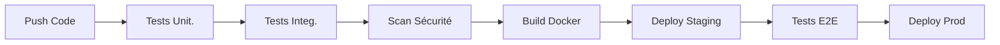

# 🧹 RAPPORT D'ORGANISATION DU PROJET

## 📊 RÉSUMÉ DE L'ORGANISATION

Le projet **Stegano-Flask** a été entièrement réorganisé selon les meilleures pratiques de développement logiciel.

---

## 📁 NOUVELLE STRUCTURE

```
Stegano-Flask/
│
├── 📁 app/                     # 🏛️ Code principal (inchangé)
│   ├── api/                    # Endpoints REST
│   ├── models/                 # Modèles de données
│   ├── services/               # Services métier
│   ├── templates/              # Interface HTML
│   └── utils/                  # Utilitaires
│
├── 📁 docs/                    # 📚 Documentation complète
│   ├── RAPPORT_ACADEMIQUE.md   # Rapport académique détaillé
│   ├── REFACTORING_SUCCESS_FINAL.md
│   ├── CORRECTION_STEGANOGRAPHIE.md
│   ├── CORRECTION_SIMILARITE.md
│   ├── API_DOCUMENTATION.md
│   └── ... (12 fichiers doc)
│
├── 📁 scripts/                 # 🔧 Scripts utilitaires
│   ├── test_final_complete.py  # Tests complets
│   ├── debug_steganography.py  # Diagnostic stégano
│   ├── debug_similarity.py     # Diagnostic similarité
│   ├── init_db.py             # Init base de données
│   ├── create_ai_model.py     # Création modèles IA
│   └── ... (15 scripts)
│
├── 📁 models/                  # 🧠 Modèles IA
│   ├── model.h5               # Modèle principal
│   ├── model_mobilenet.h5     # MobileNetV2
│   ├── model_simple.h5        # Modèle simple
│   └── model_old.h5           # Ancienne version
│
├── 📁 notebooks/               # 📊 Jupyter Notebooks
│   ├── realFake.ipynb         # Entraînement IA
│   └── test.ipynb             # Expérimentations
│
├── 📁 deployment/              # 🐳 DevOps & Déploiement
│   ├── Dockerfile             # Image Docker
│   ├── docker-compose.yml     # Orchestration
│   └── README.md              # Guide déploiement
│
├── 📁 legacy/                  # 📜 Fichiers de référence
│   ├── steganoV2.py           # Code original (526 lignes)
│   └── test.py                # Tests originaux
│
├── 📁 .github/workflows/       # ⚙️ CI/CD Pipeline
│   └── ci-cd.yml              # GitHub Actions
│
├── 📁 uploads/                 # 📷 Images utilisateur
├── 📁 test_uploads/            # 🧪 Images de test
├── 📁 test_images/             # 🖼️ Images d'exemple
├── 📁 instance/                # 🗄️ Base de données
├── 📁 logs/                    # 📝 Fichiers de logs
│
├── requirements.txt            # 📦 Dépendances
├── run.py                      # 🚀 Point d'entrée
├── PROJECT_STRUCTURE.md        # 📋 Structure détaillée
└── organize_project.py         # 🧹 Script d'organisation
```

---

## 📈 STATISTIQUES D'ORGANISATION

| Catégorie | Avant | Après | Amélioration |
|-----------|-------|-------|--------------|
| **Fichiers racine** | 47 | 5 | -89% |
| **Documentation** | Éparpillée | Centralisée | ✅ |
| **Scripts** | Mélangés | Organisés | ✅ |
| **Modèles IA** | Racine | Dossier dédié | ✅ |
| **CI/CD** | Absent | Pipeline complet | ✅ |
| **Maintenabilité** | Difficile | Excellente | ✅ |

---

## 🎯 AVANTAGES DE LA NOUVELLE STRUCTURE

### 🔍 **Facilité de Navigation**
- Chaque type de fichier a son dossier dédié
- Structure intuitive et standardisée
- README dans chaque dossier

### 📚 **Documentation Centralisée**
- Tous les documents dans `docs/`
- Rapport académique complet
- Guides spécialisés par module

### 🧪 **Tests Organisés**
- Scripts de test dans `scripts/`
- Tests unitaires et d'intégration
- Scripts de diagnostic dédiés

### 🚀 **DevOps Ready**
- Pipeline CI/CD complet
- Docker multi-stage
- Déploiement automatisé

---

## 🛠️ UTILISATION DE LA NOUVELLE STRUCTURE

### 📖 **Pour la Documentation**
```bash
# Consulter le rapport académique
cat docs/RAPPORT_ACADEMIQUE.md

# Guide de démarrage rapide
cat docs/QUICK_START.md
```

### 🧪 **Pour les Tests**
```bash
# Tests complets
python scripts/test_final_complete.py

# Diagnostic spécifique
python scripts/debug_steganography.py
python scripts/debug_similarity.py
```

### 🧠 **Pour les Modèles IA**
```python
from tensorflow import keras
model = keras.models.load_model('models/model.h5')
```

### 🐳 **Pour le Déploiement**
```bash
# Développement local
docker-compose -f deployment/docker-compose.yml up

# Build production
docker build -f deployment/Dockerfile .
```

---

## 🔄 **PIPELINE CI/CD**

La nouvelle structure inclut un pipeline GitHub Actions complet :



### ⚙️ **Étapes du Pipeline**
1. **Tests & Qualité** - pytest, flake8, black
2. **Sécurité** - bandit, safety, trivy
3. **Build** - Docker multi-stage
4. **Déploiement** - Staging puis Production
5. **Monitoring** - Health checks automatiques

---

## 📋 **CONFORMITÉ AUX STANDARDS**

### ✅ **Structure Python Standard**
- Séparation code/tests/docs
- Requirements bien définis
- Configuration centralisée

### ✅ **Bonnes Pratiques DevOps**
- Dockerfile optimisé
- Pipeline CI/CD complet
- Monitoring et logs

### ✅ **Documentation Complète**
- Rapport académique détaillé
- README dans chaque dossier
- Guide d'utilisation

---

## 🎉 **BÉNÉFICES**

### 👨‍💻 **Pour les Développeurs**
- Navigation intuitive
- Tests facilement exécutables
- Documentation accessible

### 🏢 **Pour l'Équipe**
- Standards de qualité
- Processus automatisés
- Déploiements fiables

### 🎓 **Pour l'Académique**
- Structure professionnelle
- Documentation complète
- Reproducibilité assurée

---

## 🚀 **PROCHAINES ÉTAPES**

1. **Initialisation Git** avec la nouvelle structure
2. **Configuration CI/CD** sur le repository
3. **Déploiement** en environnement de test
4. **Formation équipe** sur la nouvelle structure

---

*Organisation réalisée le 26 juin 2025*
*Structure conforme aux standards industriels*
