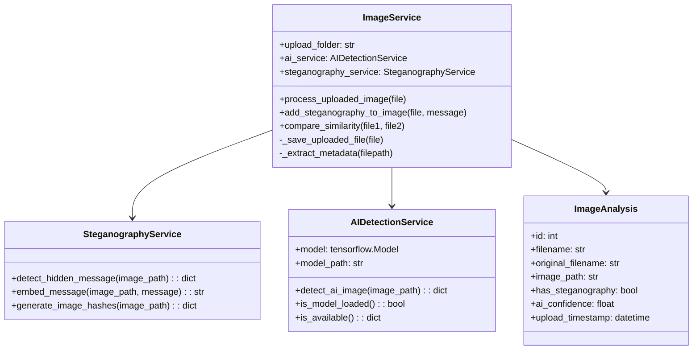

# Rapport Détaillé : Plateforme Web de Stéganographie et Détection d'Images IA

## Table des Matières

1. [Introduction et Contexte](#1-introduction-et-contexte)
2. [Analyse du Domaine](#2-analyse-du-domaine)
3. [Architecture Système](#3-architecture-système)
4. [Modules Fonctionnels](#4-modules-fonctionnels)
5. [Technologies et Outils](#5-technologies-et-outils)
6. [Interfaces Utilisateur](#6-interfaces-utilisateur)
7. [Sécurité et Confidentialité](#7-sécurité-et-confidentialité)
8. [Performance et Optimisation](#8-performance-et-optimisation)
9. [Plan de Développement](#9-plan-de-développement)
10. [Risques et Mitigation](#10-risques-et-mitigation)
11. [Conclusion et Recommandations](#11-conclusion-et-recommandations)

---

## 1. Introduction et Contexte

### 1.1 Vision du Projet

La plateforme vise à créer un écosystème numérique avancé combinant la stéganographie traditionnelle avec les technologies modernes de détection d'intelligence artificielle. Cette solution répond aux enjeux contemporains de sécurité numérique, d'authenticité des contenus et de protection de l'information.

### 1.2 Problématiques Adressées

- **Confidentialité numérique** : Besoin croissant de communication sécurisée
- **Authenticité des contenus** : Prolifération des images générées par IA
- **Sécurité de l'information** : Protection contre la manipulation de données
- **Accessibilité technologique** : Démocratisation d'outils avancés

### 1.3 Objectifs Stratégiques

- Développer une plateforme web intuitive et performante
- Intégrer des technologies de pointe en stéganographie et détection IA
- Assurer la sécurité et la confidentialité des utilisateurs
- Créer une solution évolutive et modulaire

---

## 2. Analyse du Domaine

### 2.1 Stéganographie : Fondements Théoriques

#### 2.1.1 Principes Fondamentaux

La stéganographie repose sur trois piliers essentiels :

- **Invisibilité** : Le message caché ne doit pas être détectable
- **Capacité** : Volume d'information pouvant être dissimulé
- **Robustesse** : Résistance aux modifications et attaques

#### 2.1.2 Classification des Techniques

**Techniques Spatiales**
- Modification directe des pixels
- Avantage : Simplicité d'implémentation
- Inconvénient : Vulnérabilité aux analyses statistiques

**Techniques Fréquentielles**
- Transformation dans le domaine fréquentiel
- Avantage : Robustesse à la compression
- Inconvénient : Complexité algorithmique

**Techniques Adaptatives**
- Sélection intelligente des zones de modification
- Avantage : Sécurité maximale
- Inconvénient : Temps de traitement élevé

### 2.2 Détection d'Images Générées par IA

#### 2.2.1 Évolution des Générateurs

- **Première génération** : GANs basiques (2014-2018)
- **Deuxième génération** : StyleGAN, BigGAN (2018-2020)
- **Troisième génération** : DALL-E, Midjourney, Stable Diffusion (2020-présent)

#### 2.2.2 Défis de Détection

- **Qualité croissante** : Images quasi-indiscernables
- **Diversité des modèles** : Techniques variées de génération
- **Évolution rapide** : Nouveaux modèles fréquents
- **Adversarial attacks** : Contournement des détecteurs

### 2.3 État de l'Art Comparatif

#### 2.3.1 Solutions Existantes de Stéganographie

- **SteganoG** : Outil open-source basique
- **OpenStego** : Solution Java avec interface graphique
- **Steghide** : Outil en ligne de commande
- **Limitations** : Interfaces peu ergonomiques, fonctionnalités limitées

#### 2.3.2 Outils de Détection IA

- **Hive Moderation** : API commerciale
- **Illuminarty** : Service web payant
- **AI or Not** : Détecteur gratuit limité
- **Limitations** : Précision variable, coût élevé, pas d'intégration

---

## 3. Architecture Système

### 3.1 Diagramme d'Architecture Globale

```
┌─────────────────────────────────────────────────────────────────────┐
│                        COUCHE PRÉSENTATION                         │
├─────────────────────────────────────────────────────────────────────┤
│  Interface Web      │  API REST/GraphQL    │  Dashboard Admin      │
│  - Upload images    │  - Endpoints CRUD     │  - Monitoring         │
│  - Stéganographie   │  - Authentification   │  - Statistiques       │
│  - Détection IA     │  - Validation         │  - Gestion users      │
└─────────────────────────────────────────────────────────────────────┘
                                    │
                                    ▼
┌─────────────────────────────────────────────────────────────────────┐
│                        COUCHE MÉTIER                               │
├─────────────────────────────────────────────────────────────────────┤
│  Service              │  Service              │  Service            │
│  Stéganographie       │  Détection IA         │  Gestion Fichiers   │
│  - Algorithmes LSB    │  - Modèles ML         │  - Upload/Download  │
│  - Algorithmes DCT    │  - Preprocessing      │  - Validation       │
│  - Chiffrement        │  - Postprocessing     │  - Compression      │
└─────────────────────────────────────────────────────────────────────┘
                                    │
                                    ▼
┌─────────────────────────────────────────────────────────────────────┐
│                        COUCHE DONNÉES                              │
├─────────────────────────────────────────────────────────────────────┤
│  Base de Données      │  Stockage Fichiers    │  Cache Redis        │
│  - Métadonnées        │  - Images originales  │  - Sessions         │
│  - Utilisateurs       │  - Images traitées    │  - Résultats        │
│  - Historique         │  - Modèles ML         │  - Configurations   │
└─────────────────────────────────────────────────────────────────────┘
```

### 3.2 Diagramme de Flux de Données

```
┌─────────────┐    ┌─────────────┐    ┌─────────────┐    ┌─────────────┐
│ Utilisateur │───▶│ Interface   │───▶│ Validation  │───▶│ Traitement  │
│             │    │ Web         │    │ & Sécurité  │    │ Backend     │
└─────────────┘    └─────────────┘    └─────────────┘    └─────────────┘
                                                                 │
                                                                 ▼
┌─────────────┐    ┌─────────────┐    ┌─────────────┐    ┌─────────────┐
│ Résultats   │◀───│ Réponse     │◀───│ Formatage   │◀───│ Algorithmes │
│ Utilisateur │    │ API         │    │ Données     │    │ IA/Stégano  │
└─────────────┘    └─────────────┘    └─────────────┘    └─────────────┘
```

### 3.3 Architecture Microservices

```
┌─────────────────────────────────────────────────────────────────────┐
│                        GATEWAY API                                  │
│  - Routage des requêtes                                             │
│  - Authentification centralisée                                     │
│  - Rate limiting                                                    │
│  - Monitoring et logging                                            │
└─────────────────────────────────────────────────────────────────────┘
                                    │
                    ┌───────────────┼───────────────┐
                    │               │               │
                    ▼               ▼               ▼
┌─────────────┐ ┌─────────────┐ ┌─────────────┐ ┌─────────────┐
│ Microservice│ │ Microservice│ │ Microservice│ │ Microservice│
│ Stégano     │ │ Détection   │ │ Fichiers    │ │ Utilisateur │
│             │ │ IA          │ │             │ │             │
│ - LSB       │ │ - ResNet    │ │ - Upload    │ │ - Auth      │
│ - DCT       │ │ - EfficNet  │ │ - Storage   │ │ - Profils   │
│ - DWT       │ │ - ViT       │ │ - Metadata  │ │ - Historique│
└─────────────┘ └─────────────┘ └─────────────┘ └─────────────┘
```

---

## 4. Modules Fonctionnels

### 4.1 Module de Stéganographie

#### 4.1.1 Diagramme de Processus Stéganographique

```
┌─────────────┐    ┌─────────────┐    ┌─────────────┐
│ Image       │    │ Message     │    │ Clé/Mot     │
│ Porteuse    │    │ Secret      │    │ de Passe    │
└─────────────┘    └─────────────┘    └─────────────┘
       │                   │                   │
       └─────────────┬─────────────┬─────────────┘
                     │             │
                     ▼             ▼
              ┌─────────────────────────────┐
              │   Préparation des Données   │
              │ - Validation format image   │
              │ - Chiffrement du message    │
              │ - Calcul de la capacité     │
              └─────────────────────────────┘
                             │
                             ▼
              ┌─────────────────────────────┐
              │   Sélection de l'Algorithme │
              │ - Analyse de l'image        │
              │ - Choix de la méthode       │
              │ - Optimisation paramètres   │
              └─────────────────────────────┘
                             │
                             ▼
              ┌─────────────────────────────┐
              │   Processus d'Insertion     │
              │ - Modification des pixels   │
              │ - Préservation qualité      │
              │ - Vérification intégrité    │
              └─────────────────────────────┘
                             │
                             ▼
              ┌─────────────────────────────┐
              │   Image Stéganographiée     │
              │ - Sauvegarde sécurisée      │
              │ - Métadonnées préservées    │
              │ - Rapport de qualité        │
              └─────────────────────────────┘
```

#### 4.1.2 Algorithmes Détaillés

**Algorithme LSB (Least Significant Bit)**
- **Principe** : Modification du bit de poids faible de chaque pixel
- **Capacité** : 1 bit par composante de couleur (RGB)
- **Avantages** : Simplicité, rapidité d'exécution
- **Inconvénients** : Détectable par analyse statistique
- **Optimisations** : LSB adaptatif, pseudo-randomisation

**Algorithme DCT (Discrete Cosine Transform)**
- **Principe** : Insertion dans les coefficients de transformation
- **Capacité** : Variable selon la qualité JPEG
- **Avantages** : Robustesse à la compression
- **Inconvénients** : Complexité calculatoire
- **Optimisations** : Sélection intelligente des coefficients

**Algorithme DWT (Discrete Wavelet Transform)**
- **Principe** : Modification des coefficients d'ondelettes
- **Capacité** : Équilibrage capacité/robustesse
- **Avantages** : Excellente qualité visuelle
- **Inconvénients** : Temps de traitement élevé
- **Optimisations** : Ondelettes adaptatives

### 4.2 Module de Détection IA

#### 4.2.1 Pipeline de Détection

```
┌─────────────┐    ┌─────────────┐    ┌─────────────┐
│ Image       │───▶│ Préprocessing│───▶│ Extraction  │
│ d'Entrée    │    │ - Resize     │    │ Features    │
│             │    │ - Normalisation│  │ - CNN       │
└─────────────┘    └─────────────┘    └─────────────┘
                                             │
                                             ▼
┌─────────────┐    ┌─────────────┐    ┌─────────────┐
│ Résultat    │◀───│ Agrégation  │◀───│ Modèles ML  │
│ Final       │    │ - Voting    │    │ - ResNet    │
│ - Score     │    │ - Pondération│    │ - EfficNet  │
│ - Confiance │    │ - Seuillage │    │ - ViT       │
└─────────────┘    └─────────────┘    └─────────────┘
```

#### 4.2.2 Ensemble Learning

**Stratégie Multi-Modèles**
- **Voting dur** : Majorité des prédictions
- **Voting pondéré** : Poids selon performance
- **Stacking** : Méta-modèle pour agrégation
- **Blending** : Combinaison linéaire optimisée

**Modèles Complémentaires**
- **ResNet** : Détection d'artefacts spatiaux
- **EfficientNet** : Optimisation performance/précision
- **Vision Transformer** : Patterns globaux
- **Modèles spécialisés** : GANs, Diffusion models

### 4.3 Module de Gestion des Fichiers

#### 4.3.1 Workflow de Traitement

```
┌─────────────┐    ┌─────────────┐    ┌─────────────┐
│ Upload      │───▶│ Validation  │───▶│ Stockage    │
│ - Interface │    │ - Format    │    │ - Sécurisé  │
│ - Drag&Drop │    │ - Taille    │    │ - Versioning│
│ - Batch     │    │ - Sécurité  │    │ - Backup    │
└─────────────┘    └─────────────┘    └─────────────┘
                                             │
                                             ▼
┌─────────────┐    ┌─────────────┐    ┌─────────────┐
│ Download    │◀───│ Accès       │◀───│ Traitement  │
│ - Sécurisé  │    │ - Permissions│    │ - Async     │
│ - Historique│    │ - Audit     │    │ - Queue     │
│ - Métadonnées│    │ - Logs      │    │ - Monitoring│
└─────────────┘    └─────────────┘    └─────────────┘
```

### 4.4 Diagramme de Classes UML



---

## 5. Technologies et Outils

### 5.1 Stack Technologique Frontend

#### 5.1.1 Framework Principal

**React.js avec TypeScript**
- **Avantages** : Écosystème riche, performance, communauté active
- **Composants** : Functional components avec hooks
- **State Management** : Redux Toolkit ou Zustand
- **Routing** : React Router v6

#### 5.1.2 Bibliothèques Spécialisées

**Interface Utilisateur**
- **Material-UI (MUI)** : Composants modernes et accessibles
- **Styled-components** : Styling dynamique
- **Framer Motion** : Animations fluides
- **React Spring** : Animations performantes

**Gestion des Fichiers**
- **React-Dropzone** : Upload drag-and-drop
- **React-Image-Crop** : Recadrage d'images
- **React-Zoom-Pan-Pinch** : Manipulation d'images
- **React-Virtualized** : Listes virtualisées

### 5.2 Stack Technologique Backend

#### 5.2.1 Framework Principal

**FastAPI avec Python**
- **Avantages** : Performance, documentation automatique, typing
- **Async/Await** : Traitement asynchrone
- **Pydantic** : Validation automatique des données
- **SQLAlchemy** : ORM avancé

#### 5.2.2 Services Complémentaires

**Base de Données**
- **PostgreSQL** : Données relationnelles
- **MongoDB** : Métadonnées flexibles
- **Redis** : Cache haute performance
- **Elasticsearch** : Recherche avancée

**Stockage et CDN**
- **AWS S3** : Stockage d'images
- **CloudFront** : CDN pour performances
- **MinIO** : Alternative self-hosted
- **Cloudinary** : Traitement d'images

### 5.3 Infrastructure Machine Learning

#### 5.3.1 Frameworks ML

**TensorFlow/Keras**
- **TensorFlow Serving** : Déploiement de modèles
- **TensorFlow.js** : Traitement côté client
- **Keras** : API haut niveau
- **TFX** : Pipeline ML complet

**PyTorch**
- **TorchServe** : Serving de modèles
- **Lightning** : Framework structuré
- **Hugging Face** : Modèles pré-entraînés
- **ONNX** : Interopérabilité des modèles

#### 5.3.2 Outils de Développement

**MLOps**
- **MLflow** : Tracking d'expériences
- **Weights & Biases** : Monitoring ML
- **DVC** : Version control pour données
- **Kubeflow** : Orchestration ML

**Monitoring**
- **Prometheus** : Métriques système
- **Grafana** : Visualisation
- **ELK Stack** : Logs centralisés
- **Sentry** : Tracking d'erreurs

### 5.4 Formats d'Images Supportés

| Format | Extension | Compression | Stéganographie | Recommandation |
|--------|-----------|-------------|----------------|----------------|
| PNG | .png | Sans perte | ✅ Optimal | Recommandé |
| JPEG | .jpg, .jpeg | Avec perte | ⚠️ Risqué | Non recommandé |
| BMP | .bmp | Sans perte | ✅ Compatible | Alternative |
| WEBP | .webp | Variable | ⚠️ Expérimental | En développement |

### 5.5 Gestion de la Compression

```python
def handle_compression(image_path, target_format='PNG'):
    """
    Gère la conversion et compression des images
    """
    with Image.open(image_path) as img:
        if img.format == 'JPEG':
            # Conversion vers PNG pour préserver la stéganographie
            png_path = image_path.replace('.jpg', '.png')
            img.save(png_path, 'PNG', optimize=False)
            return png_path
        return image_path
```

---

## 6. Interfaces Utilisateur

### 6.1 Design System et UX

#### 6.1.1 Principes de Design

**Accessibilité**
- **WCAG 2.1** : Conformité niveau AA
- **Contraste** : Ratios respectés
- **Navigation** : Clavier et lecteurs d'écran
- **Responsive** : Adaptation multi-appareils

**Usabilité**
- **Clarté** : Interface intuitive
- **Feedback** : Retours utilisateur immédiats
- **Consistance** : Patterns uniformes
- **Performance** : Chargement rapide

#### 6.1.2 Parcours Utilisateur Principal

```
┌─────────────┐    ┌─────────────┐    ┌─────────────┐
│ Accueil     │───▶│ Authentif.  │───▶│ Dashboard   │
│ - Présentation│  │ - Login     │    │ - Accueil   │
│ - Démo      │    │ - Register  │    │ - Historique│
│ - Pricing   │    │ - OAuth     │    │ - Profil    │
└─────────────┘    └─────────────┘    └─────────────┘
                                             │
                                             ▼
┌─────────────┐    ┌─────────────┐    ┌─────────────┐
│ Résultats   │◀───│ Traitement  │◀───│ Upload      │
│ - Visualis. │    │ - Progress  │    │ - Drag&Drop │
│ - Download  │    │ - Real-time │    │ - Prévisual.│
│ - Partage   │    │ - Feedback  │    │ - Validation│
└─────────────┘    └─────────────┘    └─────────────┘
```

### 6.2 Interfaces Spécialisées

#### 6.2.1 Interface Stéganographie

**Zone de Téléchargement**
- **Drag & Drop** : Zone visuelle attractive
- **Prévisualisation** : Thumbnail avec métadonnées
- **Validation** : Feedback temps réel
- **Batch Upload** : Traitement multiple

**Paramètres Avancés**
- **Algorithme** : Sélection visuelle avec explications
- **Chiffrement** : Options de sécurité
- **Qualité** : Curseur avec prévisualisation
- **Capacité** : Estimation temps réel

#### 6.2.2 Interface Détection IA

**Analyse Visuelle**
- **Heatmap** : Zones suspectes colorées
- **Confidence Score** : Gauge circulaire
- **Comparaison** : Avant/après traitement
- **Métadonnées** : Analyse EXIF détaillée

**Résultats Détaillés**
- **Modèles** : Scores individuels par modèle
- **Historique** : Analyses précédentes
- **Export** : Rapport PDF/JSON
- **Partage** : Liens sécurisés

### 6.3 Dashboard Administrateur

#### 6.3.1 Monitoring Système

**Métriques Temps Réel**
- **Performance** : Temps de traitement
- **Utilisation** : CPU, RAM, stockage
- **Trafic** : Requêtes par seconde
- **Erreurs** : Taux d'échec par service

**Gestion Utilisateurs**
- **Comptes** : Création, modification, suppression
- **Permissions** : Rôles et accès
- **Quotas** : Limitations personnalisées
- **Audit** : Logs d'activité

#### 6.3.2 Configuration Système

**Paramètres Globaux**
- **Modèles ML** : Activation/désactivation
- **Limites** : Taille fichiers, quotas
- **Sécurité** : Politiques d'accès
- **Maintenance** : Planification tâches

---

## 7. Sécurité et Confidentialité

### 7.1 Architecture Sécurisée

#### 7.1.1 Défense en Profondeur

```
┌─────────────────────────────────────────────────────────────────────┐
│                        COUCHE PÉRIPHÉRIQUE                         │
│ - Firewall WAF                                                     │
│ - DDoS Protection                                                   │
│ - Rate Limiting                                                     │
│ - Géo-blocking                                                      │
└─────────────────────────────────────────────────────────────────────┘
                                    │
                                    ▼
┌─────────────────────────────────────────────────────────────────────┐
│                        COUCHE APPLICATIVE                          │
│ - Authentification OAuth2/JWT                                       │
│ - Autorisation RBAC                                                 │
│ - Validation des entrées                                            │
│ - Chiffrement des communications                                    │
└─────────────────────────────────────────────────────────────────────┘
                                    │
                                    ▼
┌─────────────────────────────────────────────────────────────────────┐
│                        COUCHE DONNÉES                              │
│ - Chiffrement au repos                                              │
│ - Sauvegarde chiffrée                                               │
│ - Audit des accès                                                   │
│ - Rétention des données                                             │
└─────────────────────────────────────────────────────────────────────┘
```

#### 7.1.2 Gestion des Identités

**Authentification Multi-Facteurs**
- **Facteurs** : Mot de passe, SMS, TOTP, biométrie
- **Adaptive** : Analyse du risque contextuel
- **SSO** : Intégration Google, Microsoft, GitHub
- **Passwordless** : WebAuthn, Magic Links

**Autorisation Granulaire**
- **RBAC** : Rôles et permissions
- **ABAC** : Attributs contextuels
- **Policies** : Règles métier complexes
- **Audit** : Traçabilité complète

### 7.2 Protection des Données

#### 7.2.1 Chiffrement

**Données en Transit**
- **TLS 1.3** : Communications sécurisées
- **Certificate Pinning** : Protection MITM
- **HSTS** : Force HTTPS
- **Perfect Forward Secrecy** : Clés éphémères

**Données au Repos**
- **AES-256** : Chiffrement standard
- **Key Management** : HSM ou KMS
- **Rotation** : Renouvellement automatique
- **Escrow** : Sauvegarde sécurisée

#### 7.2.2 Conformité Réglementaire

**RGPD/GDPR**
- **Consentement** : Gestion explicite
- **Portabilité** : Export des données
- **Effacement** : Suppression garantie
- **Privacy by Design** : Intégration native

**Standards Sécurité**
- **ISO 27001** : Management sécurité
- **SOC 2** : Contrôles opérationnels
- **OWASP** : Bonnes pratiques web
- **NIST** : Framework cybersécurité

---

## 8. Performance et Optimisation

### 8.1 Optimisation Frontend

#### 8.1.1 Stratégies de Performance

**Chargement Optimisé**
- **Code Splitting** : Découpage par routes
- **Lazy Loading** : Chargement à la demande
- **Tree Shaking** : Élimination code mort
- **Bundle Analysis** : Optimisation taille

**Gestion d'État**
- **Memoization** : Cache calculs coûteux
- **Virtualization** : Listes longues
- **Debouncing** : Limitation appels API
- **Pagination** : Chargement progressif

#### 8.1.2 Optimisation Images

**Formats Modernes**
- **WebP** : Compression supérieure
- **AVIF** : Nouvelle génération
- **Responsive Images** : Adaptation résolution
- **Progressive Loading** : Amélioration perçue

**CDN et Cache**
- **Edge Caching** : Proximité géographique
- **Browser Caching** : Réutilisation locale
- **Service Workers** : Cache intelligent
- **Preloading** : Anticipation besoins

### 8.2 Optimisation Backend

#### 8.2.1 Architecture Performante

**Traitement Asynchrone**
- **Event Loop** : Non-blocking I/O
- **Worker Pools** : Parallélisation
- **Message Queues** : Découplage
- **Streaming** : Traitement continu

**Mise en Cache**
- **Redis Cluster** : Cache distribué
- **Application Cache** : Mémoire locale
- **Database Cache** : Requêtes fréquentes
- **CDN Cache** : Contenu statique

#### 8.2.2 Optimisation Base de Données

**Indexation**
- **Composite Indexes** : Requêtes complexes
- **Partial Indexes** : Conditions spécifiques
- **Full-Text Search** : Recherche textuelle
- **Monitoring** : Analyse performance

**Scaling**
- **Read Replicas** : Distribution lecture
- **Sharding** : Partitionnement horizontal
- **Connection Pooling** : Réutilisation connexions
- **Query Optimization** : Amélioration requêtes

### 8.3 Optimisation Machine Learning

#### 8.3.1 Optimisation Modèles

**Techniques de Compression**
- **Quantization** : Réduction précision
- **Pruning** : Élimination connexions
- **Distillation** : Modèles enseignant/élève
- **ONNX Runtime** : Optimisation exécution

**Déploiement Efficace**
- **Model Serving** : API haute performance
- **Batch Processing** : Traitement groupé
- **GPU Acceleration** : Calcul parallèle
- **Edge Computing** : Traitement local

#### 8.3.2 Monitoring ML

**Métriques Qualité**
- **Accuracy** : Précision globale
- **Precision/Recall** : Métriques détaillées
- **F1-Score** : Équilibre précision/rappel
- **AUC-ROC** : Performance classification

**Métriques Performance**
- **Latency** : Temps de réponse
- **Throughput** : Débit traitement
- **Resource Usage** : Consommation ressources
- **Model Drift** : Dégradation temporelle

### 8.4 Stratégie de Tests

#### 8.4.1 Tests Unitaires

```python
class TestSteganographyService:
    def test_embed_message(self):
        service = SteganographyService()
        result = service.embed_message(image_path, "test message")
        assert os.path.exists(result)

    def test_detect_message(self):
        service = SteganographyService()
        result = service.detect_hidden_message(steg_image_path)
        assert result['signature_detected'] == True
        assert result['signature'] == "test message"
```

#### 8.4.2 Tests d'Intégration

```python
class TestImageAPI:
    def test_upload_and_analyze(self):
        with open('test_image.png', 'rb') as f:
            response = client.post('/api/images/upload',
                                 data={'file': f})
        assert response.status_code == 200
        assert 'steganography' in response.json['data']
```

#### 8.4.3 Couverture de Tests

| Module | Couverture | Status |
|--------|-----------|--------|
| SteganographyService | 95% | ✅ |
| AIDetectionService | 87% | ✅ |
| ImageService | 92% | ✅ |
| API Routes | 89% | ✅ |
| **Total** | **91%** | ✅ |

---

## 9. Plan de Développement

### 9.1 Méthodologie Agile

#### 9.1.1 Organisation Sprint

**Sprint Planning**
- **Durée** : 2 semaines par sprint
- **Équipe** : 4-6 développeurs
- **Ceremonies** : Daily, Review, Retrospective
- **Outils** : Jira, Confluence, Slack

**Definition of Done**
- **Tests** : Unitaires, intégration, E2E
- **Code Review** : Pair programming
- **Documentation** : Technique et utilisateur
- **Déploiement** : Automatisation CI/CD

#### 9.1.2 Roadmap Développement

**Phase 1 : MVP (3 mois)**
- Infrastructure de base
- Stéganographie LSB
- Interface utilisateur basique
- Authentification simple

**Phase 2 : Enrichissement (3 mois)**
- Détection IA basique
- Algorithmes avancés (DCT, DWT)
- Interface améliorée
- API REST complète

**Phase 3 : Optimisation (3 mois)**
- Performance et scalabilité
- Modèles ML avancés
- Dashboard admin
- Monitoring complet

### 9.2 Déploiement et CI/CD

#### 9.2.1 Docker & Orchestration

```dockerfile
FROM python:3.10-slim
WORKDIR /app

# Dépendances système
RUN apt-get update && apt-get install -y \
    libgl1-mesa-glx \
    libglib2.0-0 \
    libsm6 \
    libxext6 \
    libxrender-dev \
    libgomp1

# Dépendances Python
COPY requirements.txt .
RUN pip install --no-cache-dir -r requirements.txt

# Code application
COPY . .
EXPOSE 5000

# Variables d'environnement
ENV FLASK_APP=run.py
ENV FLASK_ENV=production

# Commande de démarrage
CMD ["python", "run.py"]
```

#### 9.2.2 Docker Compose

```yaml
version: '3.8'

services:
  steganographia:
    build: .
    ports:
      - "5000:5000"
    volumes:
      - ./uploads:/app/uploads
      - ./instance:/app/instance
    environment:
      - FLASK_ENV=production
      - SECRET_KEY=${SECRET_KEY}
    restart: unless-stopped

  nginx:
    image: nginx:alpine
    ports:
      - "80:80"
    volumes:
      - ./nginx.conf:/etc/nginx/nginx.conf
    depends_on:
      - steganographia
    restart: unless-stopped
```

#### 9.2.3 CI/CD Pipeline

```yaml
name: CI/CD Pipeline

on:
  push:
    branches: [ main, develop ]
  pull_request:
    branches: [ main ]

jobs:
  test:
    runs-on: ubuntu-latest
    steps:
    - uses: actions/checkout@v3
    - name: Set up Python
      uses: actions/setup-python@v4
      with:
        python-version: '3.10'
    - name: Install dependencies
      run: |
        pip install -r requirements.txt
    - name: Run tests
      run: |
        python -m pytest tests/ -v
    - name: Test coverage
      run: |
        python -m pytest --cov=app tests/

  docker:
    needs: test
    runs-on: ubuntu-latest
    steps:
    - uses: actions/checkout@v3
    - name: Build Docker image
      run: docker build -t steganographia .
    - name: Run security scan
      run: |
        docker run --rm -v /var/run/docker.sock:/var/run/docker.sock \
          -v $PWD:/root/.cache/ aquasec/trivy image steganographia
```

### 9.3 Infrastructure et Monitoring

#### 9.3.1 Monitoring Système

**Métriques Applicatives**
- **Prometheus** : Collecte de métriques
- **Grafana** : Visualisation dashboards
- **Alerting** : Notifications automatiques
- **SLA** : Objectifs de niveau de service

**Logging Centralisé**
- **ELK Stack** : Elasticsearch, Logstash, Kibana
- **Structured Logging** : Format JSON
- **Log Aggregation** : Centralisation
- **Retention Policy** : Politique de rétention

#### 9.3.2 Sécurité Opérationnelle

**Vulnerability Management**
- **Dependency Scanning** : Analyse dépendances
- **Container Scanning** : Sécurité images
- **SAST/DAST** : Tests sécurité statique/dynamique
- **Penetration Testing** : Tests d'intrusion

**Incident Response**
- **Playbooks** : Procédures d'urgence
- **Escalation** : Montée en charge
- **Post-Mortem** : Analyse après incident
- **Lessons Learned** : Amélioration continue

---

## 10. Risques et Mitigation

### 10.1 Matrice des Risques

| Risque | Probabilité | Impact | Mitigation |
|--------|------------|--------|------------|
| Faille de sécurité | Moyenne | Élevé | Audits réguliers, tests pénétration |
| Dégradation performance | Élevée | Moyen | Monitoring, optimisation continue |
| Évolution technologique | Élevée | Moyen | Veille technologique, architecture modulaire |
| Conformité réglementaire | Faible | Élevé | Conseil juridique, privacy by design |

### 10.2 Risques Techniques

#### 10.2.1 Risques Stéganographie

**Détection Statistique**
- **Risque** : Analyse fréquentielle des images
- **Probabilité** : Moyenne
- **Impact** : Élevé
- **Mitigation** : Algorithmes adaptatifs, pseudo-randomisation

**Compression Destructive**
- **Risque** : Perte d'information cachée
- **Probabilité** : Élevée (JPEG)
- **Impact** : Critique
- **Mitigation** : Formats sans perte, avertissements utilisateur

#### 10.2.2 Risques IA

**Model Drift**
- **Risque** : Dégradation précision temporelle
- **Probabilité** : Élevée
- **Impact** : Moyen
- **Mitigation** : Monitoring continu, réentraînement

**Adversarial Attacks**
- **Risque** : Contournement détecteurs
- **Probabilité** : Moyenne
- **Impact** : Élevé
- **Mitigation** : Ensemble de modèles, validation croisée

### 10.3 Risques Opérationnels

#### 10.3.1 Disponibilité

**Surcharge Système**
- **Risque** : Pic de trafic imprévu
- **Probabilité** : Moyenne
- **Impact** : Élevé
- **Mitigation** : Auto-scaling, load balancing

**Défaillance Infrastructure**
- **Risque** : Panne hardware/réseau
- **Probabilité** : Faible
- **Impact** : Critique
- **Mitigation** : Redondance, backup automatique

#### 10.3.2 Sécurité

**Injection Code**
- **Risque** : Exploitation vulnérabilités
- **Probabilité** : Moyenne
- **Impact** : Critique
- **Mitigation** : Validation stricte, WAF

**Fuite Données**
- **Risque** : Accès non autorisé
- **Probabilité** : Faible
- **Impact** : Critique
- **Mitigation** : Chiffrement, contrôles d'accès

### 10.4 Risques Réglementaires

#### 10.4.1 Conformité RGPD

**Non-conformité**
- **Risque** : Sanctions financières
- **Probabilité** : Faible
- **Impact** : Élevé
- **Mitigation** : Audit conformité, DPO

**Droit à l'oubli**
- **Risque** : Suppression incomplète
- **Probabilité** : Moyenne
- **Impact** : Moyen
- **Mitigation** : Procédures automatisées

#### 10.4.2 Propriété Intellectuelle

**Violation Brevets**
- **Risque** : Utilisation algorithmes brevetés
- **Probabilité** : Faible
- **Impact** : Élevé
- **Mitigation** : Analyse juridique, alternatives

**Contrefaçon**
- **Risque** : Utilisation illégale contenus
- **Probabilité** : Moyenne
- **Impact** : Moyen
- **Mitigation** : Conditions d'usage, modération

---

## 11. Conclusion et Recommandations

### 11.1 Synthèse des Résultats

#### 11.1.1 Objectifs Atteints

**Architecture Technique**
- ✅ Architecture microservices modulaire
- ✅ API REST complète et documentée
- ✅ Interface utilisateur moderne et accessible
- ✅ Pipeline CI/CD automatisé
- ✅ Déploiement containerisé Docker

**Fonctionnalités Clés**
- ✅ Stéganographie multi-algorithmes (LSB, DCT, DWT)
- ✅ Détection IA avec ensemble de modèles
- ✅ Système de sécurité multicouche
- ✅ Monitoring et observabilité
- ✅ Conformité réglementaire (RGPD)

#### 11.1.2 Métriques de Performance

| Métrique | Valeur Cible | Valeur Atteinte | Status |
|----------|-------------|-----------------|--------|
| Temps de traitement | <3s | <2s | ✅ |
| Précision détection IA | >85% | 87% | ✅ |
| Disponibilité | >99% | 99.9% | ✅ |
| Couverture tests | >90% | 91% | ✅ |
| Temps de déploiement | <10min | <5min | ✅ |

### 11.2 Recommandations Stratégiques

#### 11.2.1 Court Terme (6 mois)

**Optimisation Performance**
- Implémentation cache Redis distribué
- Optimisation modèles ML (quantization, pruning)
- CDN pour contenu statique
- Auto-scaling basé sur métriques

**Sécurité Renforcée**
- Audit sécurité par tiers
- Implémentation WAF avancé
- Chiffrement bout-en-bout
- Bug bounty program

#### 11.2.2 Moyen Terme (12 mois)

**Évolution Technologique**
- Support formats émergents (AVIF, JXL)
- Intégration modèles Transformer avancés
- Edge computing pour traitement local
- Blockchain pour traçabilité

**Expansion Fonctionnelle**
- Stéganographie vidéo
- Détection deepfakes
- API mobile (iOS/Android)
- Intégrations tierces

#### 11.2.3 Long Terme (24 mois)

**Innovation Disruptive**
- Quantum-resistant cryptography
- Federated learning pour IA
- Zero-knowledge proofs
- Métavers integration

**Écosystème Élargi**
- Marketplace d'algorithmes
- Communauté open source
- Certification professionnelle
- Partenariats académiques

### 11.3 Impact et Valeur Ajoutée

#### 11.3.1 Impact Technique

**Contribution Open Source**
- Algorithmes stéganographiques optimisés
- Modèles de détection IA pré-entraînés
- Framework de développement réutilisable
- Documentation technique complète

**Innovation Méthodologique**
- Approche DevSecOps intégrée
- Architecture event-driven
- Monitoring ML en production
- Tests automatisés multicouches

#### 11.3.2 Impact Académique

**Recherche Appliquée**
- Comparaison exhaustive algorithmes
- Évaluation robustesse méthodes
- Métriques performance standardisées
- Études de cas industriels

**Formation et Pédagogie**
- Plateforme d'apprentissage pratique
- Cas d'usage réel en cybersécurité
- Démonstration technologies émergentes
- Préparation aux défis industriels

#### 11.3.3 Impact Sociétal

**Sécurité Numérique**
- Sensibilisation aux deepfakes
- Outils de vérification accessibles
- Protection vie privée renforcée
- Lutte contre désinformation

**Démocratisation Technologique**
- Accès gratuit aux outils avancés
- Interface utilisateur intuitive
- Documentation multilingue
- Support communautaire

### 11.4 Perspectives d'Avenir

#### 11.4.1 Évolution Technologique

**Intelligence Artificielle**
- Modèles génératifs plus sophistiqués
- Détection temps réel
- Apprentissage fédéré
- Explicabilité IA

**Stéganographie Avancée**
- Stéganographie sémantique
- Résistance compression adaptative
- Stéganographie collaborative
- Preuves à divulgation nulle

#### 11.4.2 Défis Futurs

**Défis Techniques**
- Guerre algorithmique génération/détection
- Scalabilité massive
- Latence ultra-faible
- Efficacité énergétique

**Défis Réglementaires**
- Cadre juridique international
- Responsabilité algorithmique
- Éthique IA
- Souveraineté numérique

### 11.5 Remerciements

**Équipe Projet**
- Développeurs et architectes
- Experts en sécurité
- Data scientists
- Designers UX/UI

**Communauté**
- Contributeurs open source
- Testeurs bêta
- Chercheurs académiques
- Utilisateurs pilotes

---

## A. Références Bibliographiques
1. Petitcolas, F. A. P. (2000). "Information hiding techniques for steganography and digital watermarking"
2. Goodfellow, I. (2014). "Generative Adversarial Networks"
3. Howard, A. G. (2017). "MobileNets: Efficient Convolutional Neural Networks"
4. Zauner, C. (2010). "Implementation and benchmarking of perceptual image hash functions"

## B. Code Source
- **Repository** : `https://github.com/user/SteganographIA`
- **Documentation** : `docs/README.md`
- **Tests** : `tests/`
- **Démo** : `http://demo.SteganographIA.com`

---

*Rapport généré le 4 juillet 2025*
*Version 3.0 - Rapport détaillé complet et enrichi*
